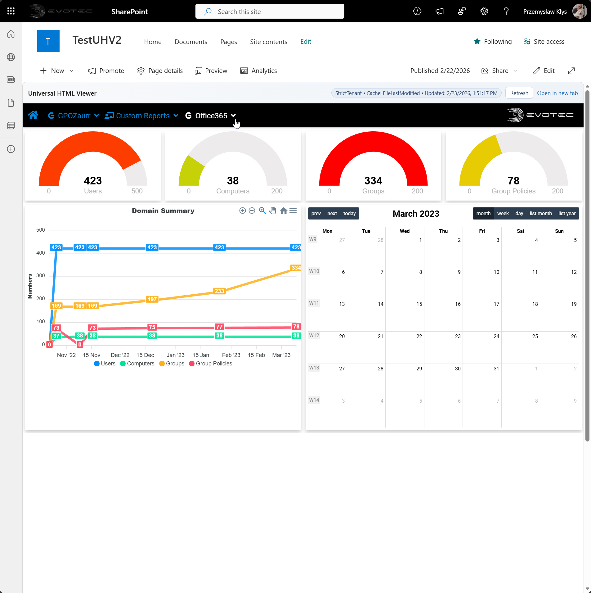
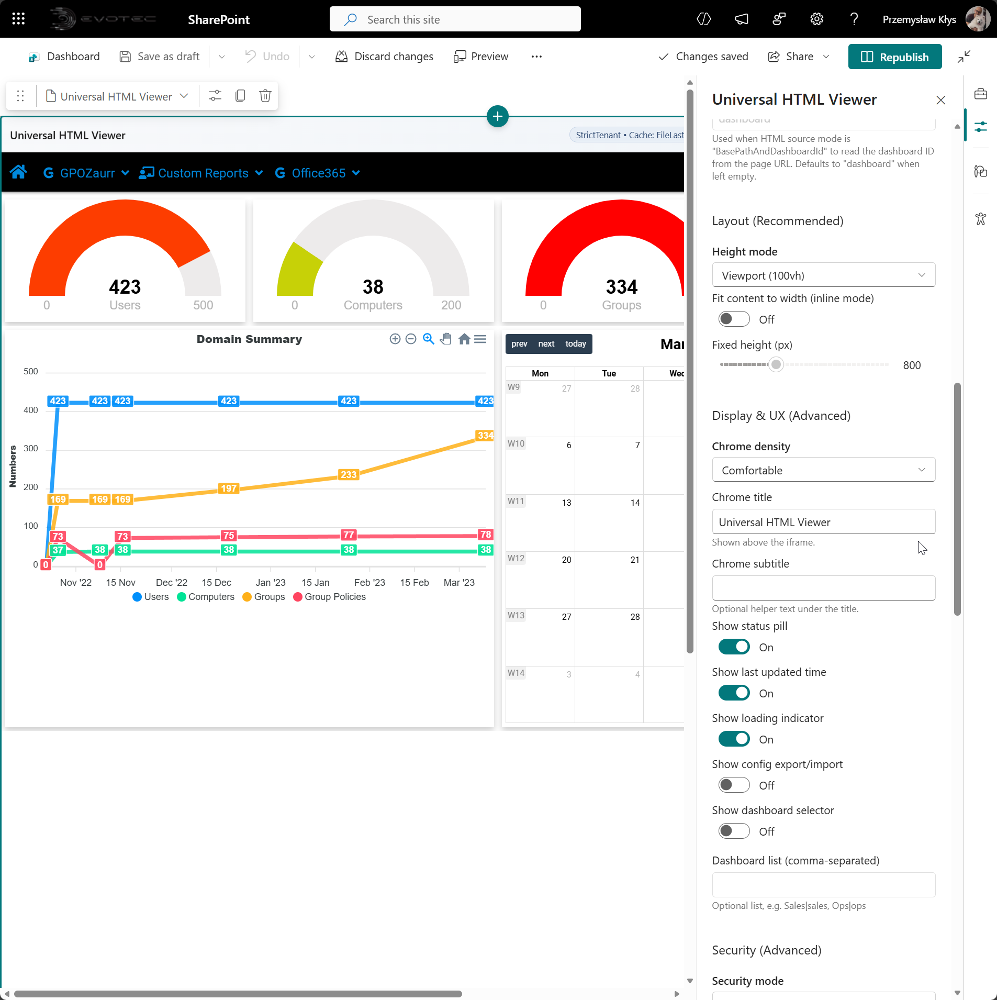
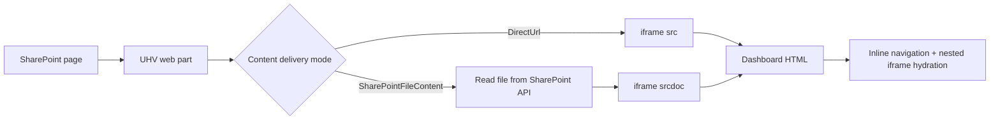
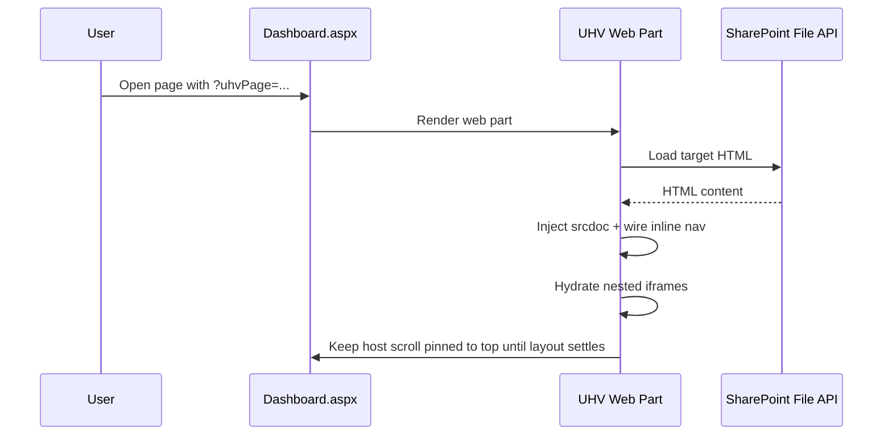
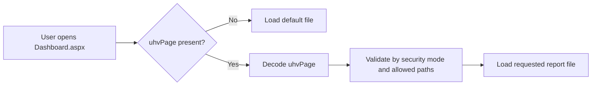
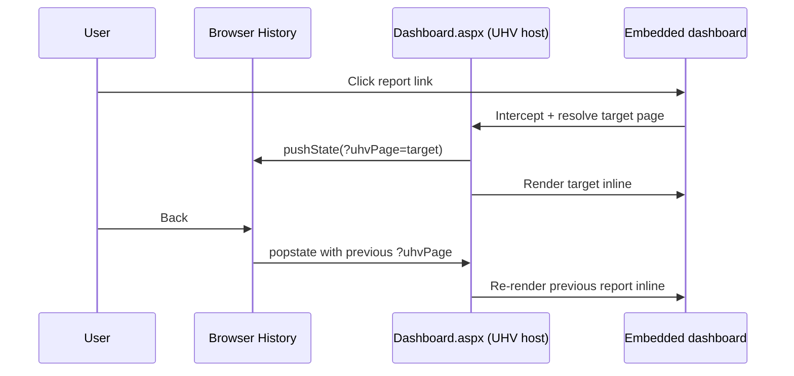

# UniversalHtmlViewer (UHV) 🚀

SPFx web part for hosting HTML dashboards in modern SharePoint pages, with deep-link navigation, inline rendering, security controls, and deployment automation.

[](https://github.com/EvotecIT/UltimateHtmlViewer/actions/workflows/spfx-tests.yml)
[](https://github.com/EvotecIT/UltimateHtmlViewer/actions/workflows/release-sppkg.yml)
[](https://github.com/EvotecIT/UltimateHtmlViewer)

## ✨ What UHV Solves

Static HTML report bundles in SharePoint often cause iframe download behavior, broken relative links, weak deep-linking, and inconsistent page scrolling. UHV provides a predictable host layer for those dashboards.

## 🧩 Key Capabilities

- Render mode selection: `DirectUrl` or `SharePointFileContent` (inline `srcdoc`).
- Deep-link support with shareable page URLs via `?uhvPage=...`.
- Nested iframe hydration for report wrappers.
- Extension-aware inline navigation (`.html`, `.htm`, `.aspx` by default).
- Strong URL policy controls: `StrictTenant`, `Allowlist`, `AnyHttps`.
- Property-pane presets for fast setup (`SharePointLibraryRelaxed`, `FullPage`, `Strict`).
- Auto-height and width-fit behavior for big dashboards.
- Scripted build/deploy/update/rollback workflows.

## 🖼️ Product Screens

### Dashboard embedded in modern page



### Dashboard menu and deep navigation


### Property pane: quick setup + source


### Property pane: layout + display



### Property pane: security + iframe


## ⚙️ How It Works





## Configuration Model

### Source and Delivery

| Setting | Options | Purpose |
| --- | --- | --- |
| `htmlSourceMode` | `FullUrl`, `BasePathAndRelativePath`, `BasePathAndDashboardId` | Defines how target HTML URL is built. |
| `contentDeliveryMode` | `DirectUrl`, `SharePointFileContent` | Chooses direct iframe URL vs inline file content from SharePoint API. |
| `queryStringParamName` | string | Query key used for dashboard ID mode. |
| `defaultFileName` | string | Default file when dashboard id/path is missing. |

### Layout and UX

| Setting | Typical value | Purpose |
| --- | --- | --- |
| `heightMode` | `Auto` | Auto-fit to content height (recommended for reports). |
| `fixedHeightPx` | `800-1000` | Minimum visual baseline in auto mode. |
| `fitContentWidth` | `true` | Shrinks wide report content to frame width. |
| `showChrome` | `true` | Top header with status/actions. |
| `showOpenInNewTab` | `true` | Gives fallback path to open raw report page. |

### Security and iframe policy

| Setting | Options | Purpose |
| --- | --- | --- |
| `securityMode` | `StrictTenant`, `Allowlist`, `AnyHttps` | URL policy boundary. |
| `allowedHosts` | host list | Explicit host allowlist for `Allowlist` mode. |
| `allowedPathPrefixes` | path list | Optional path constraints for tighter scope. |
| `sandboxPreset` | preset or custom | Controls iframe sandbox behavior. |
| `iframeAllow` | permissions policy string | Optional iframe permissions (`fullscreen`, etc.). |

## Recommended Setup (SharePoint-hosted report bundles)

- Preset: `SharePointLibraryRelaxed`
- Source mode: `FullUrl`
- Content delivery: `SharePointFileContent`
- Height mode: `Auto`
- Fit content to width: `On`
- Keep reports and linked pages in same tenant/site boundary

## 🔗 URL Contract (Deep-Linking)

UHV treats the host SharePoint page URL as the navigation state for the embedded dashboard.

### URL shapes

- Base page (default dashboard/file):
  - `https://<tenant>.sharepoint.com/sites/<site>/SitePages/Dashboard.aspx`
- Deep-linked subpage/file:
  - `https://<tenant>.sharepoint.com/sites/<site>/SitePages/Dashboard.aspx?uhvPage=%2Fsites%2F<site>%2FSiteAssets%2FGPO_Permissions.html`

### What `uhvPage` means

- `uhvPage` points to the dashboard HTML file to render inside UHV.
- Value is URL-encoded.
- Works with site-relative paths (recommended) and allowed absolute URLs (based on security mode).
- If `uhvPage` is missing, UHV falls back to configured default file.



## ⬅️➡️ Back/Forward Navigation

UHV updates the browser URL as users click inline report links, so browser history works naturally.

- Click inside dashboard menu/link:
  - UHV intercepts eligible link and keeps navigation inline.
  - Host URL is updated with `?uhvPage=...`.
- Press browser Back/Forward:
  - UHV reads current `uhvPage`.
  - Correct report file is reloaded inline.
  - No full navigation away from `Dashboard.aspx`.



## 🧠 Why This Works Reliably

- Single source of truth:
  - URL query parameter (`uhvPage`) represents current dashboard subpage.
- Controlled inline navigation:
  - UHV only intercepts approved extensions/links and normalizes paths.
- Security-gated loading:
  - All requested targets pass URL policy checks (`StrictTenant`, `Allowlist`, `AnyHttps`).
- Host-scroll protection during hydration:
  - Initial deep-link render temporarily locks host scroll until layout stabilizes.
- Nested iframe handling:
  - UHV resets nested iframe scroll context during hydration to reduce jumpy first paint.

## 🧭 Deep Links and Scroll Behavior

- Deep links are represented by `?uhvPage=<encoded-site-relative-or-absolute-path>`.
- UHV enforces top positioning during initial deep-link render.
- Scroll lock now waits for host/iframe stability and nested iframe hydration before release.
- If debugging is needed, append `?uhvTraceScroll=1` and inspect `[UHV scroll trace]` console events.

## 🔐 Permissions and Access Behavior

- UHV does not bypass SharePoint permissions.
- Access is evaluated from the viewer perspective for:
  - the SharePoint page containing UHV
  - the underlying report files/folders being loaded
- If user can open the page but not the target file, content load fails according to SharePoint security response.
- Shareable deep links still work only for users who have permission to both page and target file.

## 🛠️ Build and Deploy

Full deployment guide: `docs/Deploy-SharePointOnline.md`

### Quick commands

```powershell
# Build package
.\scripts\Build-UHV.ps1

# Build + deploy to tenant app catalog
.\scripts\Deploy-UHV-Wrapper.ps1 `
  -AppCatalogUrl "https://<tenant>.sharepoint.com/sites/appcatalog" `
  -Scope Tenant `
  -DeviceLogin `
  -ClientId "<client-guid>" `
  -Tenant "<tenant>.onmicrosoft.com" `
  -TenantAdminUrl "https://<tenant>-admin.sharepoint.com"

# Update installed app on sites
.\scripts\Update-UHVSiteApp.ps1 `
  -SiteUrls @(
    "https://<tenant>.sharepoint.com/sites/SiteA",
    "https://<tenant>.sharepoint.com/sites/SiteB"
  ) `
  -InstallIfMissing `
  -DeviceLogin `
  -ClientId "<client-guid>" `
  -Tenant "<tenant>.onmicrosoft.com"
```

## 📜 Scripts Reference

| Script | Purpose |
| --- | --- |
| `scripts/Build-UHV.ps1` | Build/package with local Node bootstrap fallback. |
| `scripts/Deploy-UHV.ps1` | Upload/publish `.sppkg` to app catalog. |
| `scripts/Deploy-UHV-Wrapper.ps1` | Build + deploy wrapper. |
| `scripts/Setup-UHVSite.ps1` | Install/update app and provision configured page. |
| `scripts/Add-UHVPage.ps1` | Add/configure UHV web part on a site page. |
| `scripts/Update-UHVSiteApp.ps1` | Update installed app on one or more sites. |
| `scripts/Rollback-UHV.ps1` | Roll back to older package and reapply site updates. |

## 🩺 Troubleshooting

- Report downloads instead of rendering: switch to `SharePointFileContent`.
- Navigation not staying inline: verify relative links and allowed extensions.
- Deep-link opens but landing position is wrong: retest with `?uhvTraceScroll=1` and review trace.
- Page editing issues (`SavePageCoAuth 400`): often SharePoint authoring state; see deployment guide.

## 📁 Repo Layout

```text
.
├─ assets/
├─ docs/
│  └─ Deploy-SharePointOnline.md
├─ scripts/
└─ spfx/
   └─ UniversalHtmlViewer/
```
