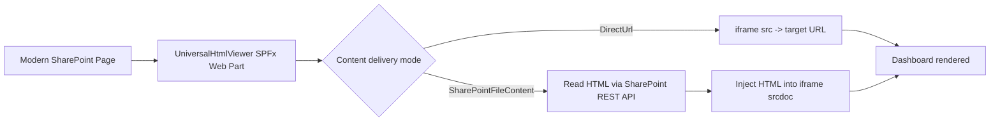
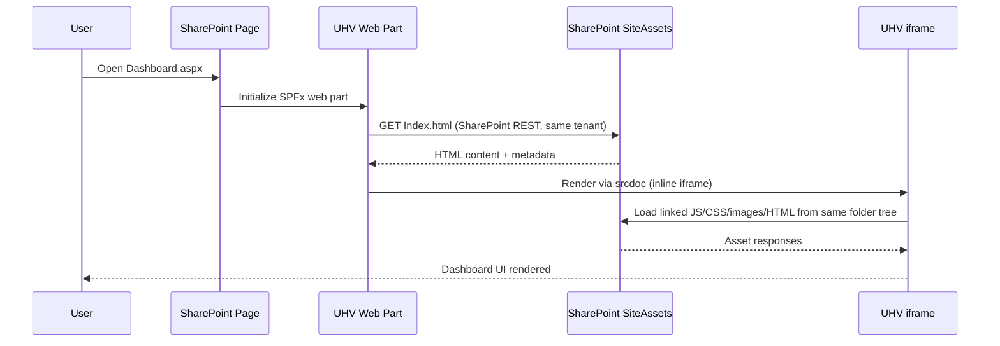

# UniversalHtmlViewer SPFx Web Part

The **UniversalHtmlViewer** web part is a SharePoint Framework (SPFx) client-side web part that renders a single `<iframe>` pointing to a static HTML page stored in SharePoint Online. It is designed to be generic and reusable across a tenant for hosting dashboards, reports, and other generated HTML pages.

**SPFx solution location:** `spfx/UniversalHtmlViewer`

In practical terms: UHV lets you keep static HTML dashboard hosting inside SharePoint sites without depending on legacy custom-script patterns.

## Quick Links

- [Features](#features)
- [What Problem UHV Solves](#what-problem-uhv-solves)
- [Architecture](#architecture)
- [End-to-End Dashboard Flow (Your Scenario)](#end-to-end-dashboard-flow-your-scenario)
- [How UHV Mitigates Custom-Script Restrictions](#how-uhv-mitigates-custom-script-restrictions)
- [Known Good Config (SharePoint Dashboard)](#known-good-config-sharepoint-dashboard)
- [Presets](#presets)
- [Tenant configuration](#tenant-configuration)
- [Installation (site-scoped)](#installation-site-scoped-no-tenant-impact)
- [Installation (tenant-wide)](#installation-tenant-wide-optional)
- [Build and package](#build-and-package)
- [Deployment scripts](#deployment-scripts)
- [Release package](#release-package)
- [Client delivery checklist](#client-delivery-checklist)
- [Property pane configuration](#property-pane-configuration)
- [URL safety and validation](#url-safety-and-validation)
- [Configuration export/import](#configuration-exportimport)
- [Troubleshooting](#troubleshooting)

## Features

- **Flexible source modes**: full URL, base path + relative path, or base path + dashboard ID from query string.
- **Content delivery modes**: direct URL iframe loading or SharePoint file API inline rendering (`srcdoc`) for tenants where `.html` files download/block in iframe mode.
- **Nested iframe support (SharePoint mode)**: wrapper pages that embed local report HTML in inner iframes are auto-inlined via SharePoint API, including runtime `iframe.src` changes.
- **Security profiles**: strict tenant, allowlist, or any HTTPS (opt-in).
- **Path controls**: optional allowed path prefixes + file extension allowlist.
- **Cache-busting**: timestamp or SharePoint file modified time / ETag.
- **Iframe controls**: sandbox presets, permissions policy, referrer policy, loading mode, title.
- **UX chrome**: optional header with title/subtitle, status pill, refresh, and “Open in new tab”.
- **Config actions**: export/import web part settings as JSON.
- **Tenant config JSON**: central defaults per client with merge/override modes.
- **Dashboard selector**: optional in-chrome search + selector for `BasePathAndDashboardId`.
- **Auto-refresh**: optional periodic reload for live dashboards.
- **Diagnostics + fallback**: optional diagnostics panel and iframe load timeout with “Open in new tab”.
- **Presets**: one-click profiles for SharePoint library hosting, allowlist CDN, or any HTTPS.

## What Problem UHV Solves

SharePoint Online increasingly restricts direct browser rendering of `.html` files from document libraries and reduces support for custom-script-dependent approaches.
This creates common enterprise pain points:

- Opening `.html` often downloads instead of rendering inline.
- Direct iframe embedding may fail due to SharePoint headers/policies.
- Classic custom-script approaches (`Script Editor`, loose inline script hosting) are not future-safe.

UHV addresses this by using a supported SPFx web part and two delivery modes:

- `DirectUrl` for cases where normal iframe loading works.
- `SharePointFileContent` for SharePoint-hosted HTML where direct iframe behavior is blocked/unreliable.

## Architecture



## End-to-End Dashboard Flow (Your Scenario)

The flow below maps to your setup (`TheDashboard` output uploaded to `SiteAssets`, UHV page on a modern SharePoint page):



For report packs where files link to each other (and nested folders), keep links relative (`./`, `../`) and set:

- `contentDeliveryMode = SharePointFileContent`
- `configurationPreset = SharePointLibraryRelaxed` (or `SharePointLibraryFullPage` for page-focused layout)

## How UHV Mitigates Custom-Script Restrictions

UHV does **not** rely on classic custom-script site customization patterns.
Instead, it uses supported modern SharePoint components:

- SPFx client-side web part (deployed from App Catalog).
- SharePoint REST file reads (same-tenant).
- iframe sandboxing and explicit allowlist/security controls.

### Why this helps

- Works on modern pages where custom script is disabled (`DenyAddAndCustomizePages = Enabled`).
- Keeps dashboard hosting inside SharePoint libraries instead of external web servers.
- Avoids requiring Script Editor / master page customization for dashboard rendering.

### What it does not bypass

- It does not disable tenant/browser security policies.
- If a dashboard requires blocked inline scripting patterns, you may still need to externalize scripts or adjust dashboard build output.
- SharePoint page canvas/layout limits still apply (UHV can improve fit, but SharePoint controls the outer container).

## Known Good Config (SharePoint Dashboard)

Use this when your dashboard files are in a SharePoint library (for example `SiteAssets`) and include linked assets/child pages.

### Recommended values

| Setting | Value |
| --- | --- |
| Configuration preset | `SharePointLibraryRelaxed` |
| HTML source mode | `Full URL` |
| Content delivery mode | `SharePoint file API (inline iframe)` |
| Full URL to HTML page | `https://<tenant>.sharepoint.com/sites/<site>/SiteAssets/Index.html` |
| Height mode | `Auto (content height)` |
| Fit content to width (inline mode) | `On` |
| Minimum height (px) | `800` to `1000` |
| Show chrome | `On` (optional) |
| Show open in new tab | `On` |
| Security mode | `StrictTenant` |

### Why this combo works

- SharePoint file API mode avoids direct `.html` iframe/download behavior issues.
- Relative links (`./`, `../`) continue to resolve in the same folder tree.
- Auto height + fit-to-width gives a dashboard-like page experience with fewer inner scrollbars.

### 1-minute validation checklist

1. Open dashboard page in edit mode.
2. Confirm `contentDeliveryMode = SharePointFileContent`.
3. Confirm `fullUrl` points to your `SiteAssets/Index.html`.
4. Save/Publish and test:
   - top-level dashboard renders,
   - in-dashboard navigation works,
   - linked child pages load.
5. If layout is still tight, increase minimum height or switch to fixed height for that page.

### Optional fast commands (repeat builds)

```powershell
.\scripts\Build-UHV.ps1 -SkipInstall -QuietNpm
```

## Presets

Presets are optional one-click profiles that set **security**, **cache**, and **iframe** defaults. Selecting a preset in the property pane updates the related settings.
If you want to keep manual overrides, switch to **Custom** after applying a preset.
Use **Lock preset settings** to enforce preset values and disable related fields.

| Preset | Intended use | Key defaults |
| --- | --- | --- |
| SharePointLibraryRelaxed | HTML in SharePoint library with broad compatibility | StrictTenant, FileLastModified, sandbox preset = Relaxed |
| SharePointLibraryFullPage | HTML in SharePoint library with edge-to-edge layout | StrictTenant, FileLastModified, sandbox preset = Relaxed, Viewport height, chrome off |
| SharePointLibraryStrict | HTML in SharePoint library with tighter sandbox | StrictTenant, FileLastModified, sandbox preset = Strict |
| AllowlistCDN | External CDN hosting with allowlist | Allowlist, Timestamp, sandbox preset = Relaxed |
| AnyHttps | Any HTTPS hosting (unsafe) | AnyHttps, Timestamp, sandbox preset = None |
| Custom | Manual settings | No changes applied |

## Tenant configuration

You can host a JSON configuration file inside a client’s SharePoint tenant and have UHV merge or override local settings.

Example JSON (`/SiteAssets/uhv-config.json`):

```json
{
  "securityMode": "StrictTenant",
  "allowedPathPrefixes": "/sites/Reports/Dashboards/",
  "allowedFileExtensions": ".html,.htm",
  "cacheBusterMode": "FileLastModified",
  "sandboxPreset": "Relaxed",
  "showChrome": true,
  "showRefreshButton": true
}
```

Use `tenantConfigMode`:
- **Merge**: apply values only when the web part field is empty.
- **Override**: tenant config wins for matching keys.

## HTML source modes

The web part supports three ways to define the iframe source URL, controlled by the **HTML source mode** property.

### 1. FullUrl

- Property: `fullUrl`
- The iframe source is used exactly as provided (after validation).
- Example: `https://contoso.sharepoint.com/sites/Reports/Dashboards/system1/index.html`

### 2. BasePathAndRelativePath

- Properties:
  - `basePath` – site-relative base path, e.g. `/sites/Reports/Dashboards/`
  - `relativePath` – relative path appended to the base, e.g. `system1/index.html`
- The final URL is calculated as:

```text
finalUrl = basePath + relativePath
```

### 3. BasePathAndDashboardId

- Properties:
  - `basePath` – site-relative base path, e.g. `/sites/Reports/Dashboards/`
  - `dashboardId` – fallback dashboard ID
  - `defaultFileName` – file name within the dashboard folder (defaults to `index.html` when empty)
  - `queryStringParamName` – name of the query string parameter used to resolve the dashboard ID (defaults to `dashboard` when empty)
- Resolution order for the effective dashboard ID:
  1. Value from the current page URL query string parameter `queryStringParamName`, if present.
  2. The `dashboardId` property as a fallback.
- The final URL is calculated as:

```text
finalUrl = basePath + dashboardId + '/' + defaultFileName
```

If no dashboard ID can be determined, the web part renders a friendly message instead of an iframe.
You can optionally enable the dashboard selector and provide `dashboardList` to allow in-page filtering.

## Height modes

The web part supports three height modes for the iframe:

### Fixed

- Property: `heightMode = "Fixed"`
- Property: `fixedHeightPx` (default: `800`)
- The iframe height is set to the specified number of pixels, e.g. `height: 800px;`.

### Viewport

- Property: `heightMode = "Viewport"`
- The iframe height is set to fill the viewport: `height: 100vh;`.

### Auto

- Property: `heightMode = "Auto"`
- Uses `fixedHeightPx` as the starting/minimum height, then auto-resizes the iframe to the inline HTML content height (SharePoint file API mode).
- Helps avoid inner vertical scrollbars for dashboard-style pages that grow/shrink after load.

## Property pane configuration

The web part exposes the following properties in the property pane:

- Group: **Quick setup (Most used)**
  - `configurationPreset` – one-click profiles for recommended settings.
  - `lockPresetSettings` – enforces preset values and disables related fields.
  - `showChrome` – shows the header with title, actions, and status.
  - `showRefreshButton` – shows a manual refresh action.
  - `showOpenInNewTab` – shows an “Open in new tab” action.
- Group: **Source (Required)**
  - `htmlSourceMode` (dropdown) – selects one of `FullUrl`, `BasePathAndRelativePath`, or `BasePathAndDashboardId`.
  - `contentDeliveryMode` (dropdown) – `DirectUrl` (default) or `SharePointFileContent`.
    - `DirectUrl`: sets iframe `src` directly to the resolved URL.
    - `SharePointFileContent`: reads same-tenant file content via SharePoint REST and renders it inline via iframe `srcdoc`.
  - `fullUrl` – used only when `htmlSourceMode = FullUrl`.
  - `basePath` – used when `htmlSourceMode` is not `FullUrl`.
  - `relativePath` – used when `htmlSourceMode = BasePathAndRelativePath`.
  - `dashboardId`, `defaultFileName`, `queryStringParamName` – used when `htmlSourceMode = BasePathAndDashboardId`.
- Group: **Layout (Recommended)**
  - `heightMode` (dropdown) – `Fixed`, `Viewport`, or `Auto`.
  - `fitContentWidth` (toggle) – scales inline content down to fit container width in SharePoint file API mode.
  - `fixedHeightPx` – numeric value used for fixed height, and as minimum/initial height in auto mode.
- Group: **Display & UX (Advanced)**
  - `showChrome` – shows the header with title, actions, and status.
  - `chromeDensity` – `Comfortable` or `Compact`.
  - `chromeTitle`, `chromeSubtitle` – header title/subtitle text.
  - `showStatus` – shows a status pill (security + cache mode).
  - `showLastUpdated` – shows last updated time in the status pill.
  - `showLoadingIndicator` – shows the loading overlay while iframe loads.
  - `showConfigActions` – shows Export/Import actions in the chrome.
  - `showDashboardSelector` – shows a dashboard selector for `BasePathAndDashboardId`.
  - `dashboardList` – comma-separated dashboard list (e.g. `Sales|sales, Ops|ops`).
- Group: **Security (Advanced)**
  - `securityMode` (dropdown) – `StrictTenant` (default), `Allowlist`, or `AnyHttps`.
  - `allowHttp` (toggle) – allows HTTP when explicitly enabled.
  - `allowedHosts` – comma-separated hostnames used when `securityMode = Allowlist`.
  - `allowedPathPrefixes` – optional site-relative path prefixes that URLs must start with.
  - `allowedFileExtensions` – optional file extensions allowlist (e.g. `.html, .htm`). Leave blank to allow any.
- Group: **Tenant configuration (Advanced)**
  - `tenantConfigUrl` – optional JSON config file (site-relative or same-tenant absolute URL).
  - `tenantConfigMode` – `Merge` or `Override`.
- Group: **Cache & refresh (Advanced)**
  - `cacheBusterMode` (dropdown) – `None`, `Timestamp`, or `FileLastModified`.
  - `cacheBusterParamName` – query string parameter name (defaults to `v`).
  - `refreshIntervalMinutes` – auto-refresh interval (0 disables).
- Group: **Iframe (Advanced)**
  - `iframeTitle` – accessibility title (defaults to `Universal HTML Viewer`).
  - `iframeLoading` – `lazy`, `eager`, or browser default.
  - `sandboxPreset` – `None`, `Relaxed`, `Strict`, or `Custom`.
  - `iframeSandbox` – space-separated sandbox tokens.
  - `iframeAllow` – permissions policy string.
  - `iframeReferrerPolicy` – referrer policy for iframe requests.
  - `iframeLoadTimeoutSeconds` – seconds before showing the fallback message (0 disables).
- Group: **Diagnostics**
  - `showDiagnostics` – shows a diagnostics panel with computed configuration and URLs.

## URL safety and validation

Before rendering the iframe, the web part:

- Rejects `javascript:`, `data:`, `vbscript:`, protocol-relative (`//`) URLs, and unknown schemes.
- Allows only site-relative paths (starting with `/`) or absolute `http/https` URLs.
- HTTP URLs are blocked by default unless `allowHttp` is enabled.
- Enforces the selected **security mode**:
  - `StrictTenant`: absolute URLs must match the current SharePoint host.
  - `Allowlist`: current host + explicitly allowed hosts.
  - `AnyHttps`: any HTTPS host (opt-in, less safe).
- Optionally enforces `allowedPathPrefixes` to keep URLs inside specific site paths.
- Optionally enforces `allowedFileExtensions` to limit file types.
- If validation fails, the web part renders a clear error message:

> UniversalHtmlViewer: The target URL is invalid or not allowed.

If no URL can be computed, a friendly message is shown:

> UniversalHtmlViewer: No URL configured. Please update the web part settings.

## Cache-busting and refresh

The web part can append a cache-busting query string to avoid stale dashboards:

- `Timestamp` appends `?v=<epoch>` on every render/refresh.
- `FileLastModified` uses SharePoint REST to read the file’s `TimeLastModified` / `ETag` and appends it.
  - If the file is external (or the API fails), it falls back to a timestamp.

You can also enable `refreshIntervalMinutes` to auto-refresh the iframe.

## Iframe controls

Optional iframe controls allow you to lock down or tune behavior:

- `sandbox` tokens (e.g., `allow-scripts allow-same-origin`)
- `sandboxPreset` simplifies common configurations; use `Custom` to apply `iframeSandbox` tokens.
- `allow` permissions policy (e.g., `fullscreen; clipboard-read; clipboard-write`)
- `referrerpolicy`, `loading`, and `title`

## Configuration export/import

Enable **Show config export/import** to download the current web part settings as JSON or import a JSON file to apply settings on another page or client. Imported settings are applied immediately; save the page to persist them.

## Styling

The web part uses minimal styling to keep the iframe clean:

- The container takes the full available width.
- The iframe:
  - Has no border.
  - Uses `width: 100%`.
  - Uses either a fixed pixel height or `100vh` depending on the configured height mode.

## Limitations

- `AnyHttps` allows any HTTPS URL, which is less safe and should be used sparingly.
- If `FileLastModified` is used for external URLs, the cache-buster falls back to timestamp.

## Prerequisites

- Node.js **>=22.14.0 <23.0.0** (recommended for this repo)
- npm

## Install dependencies

```bash
cd spfx/UniversalHtmlViewer
npm ci
```

## Local development

1) Edit `spfx/UniversalHtmlViewer/config/serve.json` and replace `{tenantDomain}` with your tenant domain.  
2) Start the dev server:

```bash
cd spfx/UniversalHtmlViewer
npm run serve
```

3) Open the SharePoint Online workbench:

```text
https://<your-tenant>.sharepoint.com/_layouts/workbench.aspx
```

## Build and package

```bash
cd spfx/UniversalHtmlViewer
npm run bundle:ship
npm run package-solution:ship
```

Or use the helper script:

```powershell
.\scripts\Build-UHV.ps1
```

`Build-UHV.ps1` auto-detects unsupported global Node.js versions and bootstraps a local Node.js `22.14.0` runtime into `.tools/` when needed.
The downloaded archive is SHA256-verified against the official Node.js `SHASUMS256.txt` before extraction.
Use `.\scripts\Build-UHV.ps1 -ForceBootstrap` to force a fresh local runtime download.
Use `.\scripts\Build-UHV.ps1 -SkipInstall` to skip `npm ci/install` when dependencies are already present.
Use `.\scripts\Build-UHV.ps1 -QuietNpm` to reduce npm deprecation/audit/funding warning noise during install.

## Release package

Create a client-ready zip with the `.sppkg`, README, and deploy script:

```powershell
.\scripts\Package-UHV.ps1 -RunBuild
```

The package is generated at:

```text
spfx/UniversalHtmlViewer/sharepoint/solution/universal-html-viewer.sppkg
```

## Installation (site-scoped, no tenant impact)

This is the recommended option for client deployments where you **must not impact other sites**.

1) Ensure the **Site Collection App Catalog** feature is enabled for the target site collection.  
2) Upload `spfx/UniversalHtmlViewer/sharepoint/solution/universal-html-viewer.sppkg` to the **site app catalog**.  
3) Approve and deploy the app.  
4) Add the **Universal HTML Viewer** web part to a page.  
5) Configure source + security settings in the property pane.  

## Installation (tenant-wide, optional)

Use this if a client wants the web part available across the tenant.

1) Upload the `.sppkg` to the **Tenant App Catalog**.  
2) Approve and deploy the app.  
3) (Optional) Enable tenant-wide deployment when publishing the app.  
4) Add the web part to pages across sites.  

## Deployment scripts

Two helper scripts can standardize build + deploy:

- `scripts/Build-UHV.ps1` – bundles and packages the `.sppkg`.
- `scripts/Deploy-UHV.ps1` – uploads and deploys to a provided app catalog URL.
- `scripts/Package-UHV.ps1` – creates a client-ready zip with the `.sppkg` and docs.
- `scripts/Deploy-UHV-Wrapper.ps1` – one-command wrapper that runs build + deploy.
- `scripts/deploy-uhv.cmd` – convenience entrypoint for the wrapper (works well on Windows).
- `scripts/Add-UHVPage.ps1` – creates a page, adds UHV, and preconfigures its URL.
- `scripts/Update-UHVSiteApp.ps1` – installs/updates UHV app across one or more sites.

SharePoint Online deployment guide: `docs/Deploy-SharePointOnline.md`

Prerequisite:

```powershell
Install-Module PnP.PowerShell -Scope CurrentUser
```

PnP authentication note (PnP.PowerShell 3.x):
- `Connect-PnPOnline -Interactive` / `-DeviceLogin` requires an Entra ID App Registration `ClientId`.
- See: `docs/Deploy-SharePointOnline.md` (Step 0).

Example:

```powershell
.\scripts\Build-UHV.ps1
.\scripts\Deploy-UHV.ps1 -AppCatalogUrl "https://contoso.sharepoint.com/sites/appcatalog" -Scope Tenant -TenantWide:$false -DeviceLogin -ClientId "<client-guid>" -Tenant "<tenant>.onmicrosoft.com"
```

Note:
- Tenant-wide deployment requires `"skipFeatureDeployment": true` in `spfx/UniversalHtmlViewer/config/package-solution.json`.
- This project currently ships with `"skipFeatureDeployment": false`, so published apps are typically installed per-site.

Or as a single command:

```powershell
.\scripts\Deploy-UHV-Wrapper.ps1 -AppCatalogUrl "https://contoso.sharepoint.com/sites/appcatalog" -DeviceLogin -ClientId "<client-guid>" -Tenant "<tenant>.onmicrosoft.com"
```

Tested tenant-app-catalog publish (no tenant-wide skip-feature deploy):

```powershell
.\scripts\Deploy-UHV-Wrapper.ps1 -AppCatalogUrl "https://evotecpoland.sharepoint.com/sites/appcatalog" -Scope Tenant -DeviceLogin -ClientId "<client-guid>" -Tenant "<tenant>.onmicrosoft.com" -TenantAdminUrl "https://evotecpoland-admin.sharepoint.com" -SkipBuild
```

Build only (no SharePoint login):

```powershell
.\scripts\Deploy-UHV-Wrapper.ps1 -AppCatalogUrl "https://example.invalid" -NoDeploy
```

Create and configure a UHV page directly from PowerShell:

```powershell
.\scripts\Add-UHVPage.ps1 `
  -SiteUrl "https://evotecpoland.sharepoint.com/sites/TestUHV1" `
  -PageName "Dashboard" `
  -PageTitle "Dashboard" `
  -PageLayoutType "Article" `
  -FullUrl "https://evotecpoland.sharepoint.com/sites/TestUHV1/SiteAssets/Index.html" `
  -ConfigurationPreset "SharePointLibraryFullPage" `
  -ContentDeliveryMode "SharePointFileContent" `
  -Publish `
  -ClientId "<client-guid>" `
  -Tenant "<tenant>.onmicrosoft.com" `
  -DeviceLogin
```

Safe isolate mode (add UHV but skip property write):

```powershell
.\scripts\Add-UHVPage.ps1 `
  -SiteUrl "https://evotecpoland.sharepoint.com/sites/TestUHV1" `
  -PageName "Dashboard-UHV-Minimal" `
  -PageTitle "Dashboard UHV Minimal" `
  -PageLayoutType "Article" `
  -SkipConfigureWebPartProperties `
  -Publish `
  -ForceOverwrite `
  -ClientId "<client-guid>" `
  -Tenant "<tenant>.onmicrosoft.com" `
  -DeviceLogin
```

Upgrade UHV app on existing sites after publishing a new `.sppkg`:

```powershell
.\scripts\Update-UHVSiteApp.ps1 `
  -SiteUrls @(
    "https://evotecpoland.sharepoint.com/sites/TestUHV1",
    "https://evotecpoland.sharepoint.com/sites/TestUHV2"
  ) `
  -InstallIfMissing `
  -ClientId "<client-guid>" `
  -Tenant "<tenant>.onmicrosoft.com" `
  -DeviceLogin
```

## Client delivery checklist

- Provide the `.sppkg` package.
- Specify the recommended deployment mode (site-scoped vs tenant-wide).
- Provide the target library path (for `basePath` / `allowedPathPrefixes`).
- Provide any CDN hostnames for `allowedHosts` (if using Allowlist).
- Provide a tenant config JSON (optional) if you want centralized defaults.

## GitHub Actions (self-hosted runners)

Workflow: `/.github/workflows/spfx-tests.yml`

- Uses `runs-on: [self-hosted, windows]` and `runs-on: [self-hosted, linux]`
- Runs `npm ci`, `npm test`, and `npm run bundle` inside `spfx/UniversalHtmlViewer`
- Packages a ship build on Linux and uploads `universal-html-viewer-sppkg` as a workflow artifact

## Running tests

Unit tests for URL computation and validation logic are located in:

- `spfx/UniversalHtmlViewer/src/webparts/universalHtmlViewer/__tests__/UrlHelper.test.ts`

Jest configuration is defined in `spfx/UniversalHtmlViewer/jest.config.js`. To run the tests, ensure dependencies are installed in the SPFx solution folder, then run:

```bash
cd spfx/UniversalHtmlViewer
npm test
```

## Troubleshooting

- **Iframe stays blank or times out**: The target HTML might send `X-Frame-Options` or a restrictive `Content-Security-Policy`. Use the “Open in new tab” action to verify direct access.  
- **File downloads instead of rendering**: Switch `contentDeliveryMode` to `SharePointFileContent` and keep the URL within the same tenant (or use a site-relative path). This mode fetches the file via SharePoint API and renders inline.
- **Linked HTML files do not open inside UHV**: Upload the whole report folder tree, keep links relative (`./`, `../`), and use `contentDeliveryMode = SharePointFileContent`. For link-heavy report packs, use `SharePointLibraryRelaxed` preset.
- **Wrapper dashboards with inner iframes fail**: keep `contentDeliveryMode = SharePointFileContent` and use `SharePointLibraryRelaxed` or `SharePointLibraryFullPage` (both include `allow-same-origin`, needed for nested iframe API loading).
- **`about:srcdoc` CSP inline-script warnings in browser console**: report-only warnings are expected in some tenants and do not necessarily block rendering. If scripts are truly blocked, convert inline `<script>` blocks to external script files hosted in SharePoint and referenced via `src`.
- **Custom script (`DenyAddAndCustomizePages`) concerns**: for dashboard sites, UHV works with custom script disabled when `contentDeliveryMode = SharePointFileContent`; App Catalog deployment prompts about no-script apply to the catalog site, not your business report sites.
- **SharePoint page editor fails with `SavePageCoAuth 400`**: if page edit exits after a few seconds even on empty new pages, that is typically a SharePoint authoring/coauthoring issue (not UHV). Temporary workaround on affected site:
  `Set-PnPList -Identity "Site Pages" -ForceCheckout:$true`
- **`Can't edit this page` + Fluid schema error (`com.fluidframework.leaf.string`) on script-created page**: recreate the page using the latest `scripts/Add-UHVPage.ps1` with `-ForceOverwrite`; the script now sets web part properties via `Set-PnPPageWebPart -PropertiesJson` for safer payloads.
- **Still seeing Fluid schema errors on a script-created page**: create page-only first (`-SkipAddWebPart`), verify edit works, then rerun without `-SkipAddWebPart`. Prefer `-PageLayoutType Article` for stability.
- **URL rejected**: Enable diagnostics and check the computed URL + validation options.  
- **Allowlist mode**: Ensure the host is in `allowedHosts` and the path matches `allowedPathPrefixes`.  
- **Build fails with Node version error**: run `.\scripts\Build-UHV.ps1`; it will automatically use a compatible local Node.js runtime for the packaging steps.
- **Too many npm deprecation warnings during build**: these are mostly transitive SPFx toolchain warnings. Use `.\scripts\Build-UHV.ps1 -SkipInstall` for repeat builds or `.\scripts\Build-UHV.ps1 -QuietNpm` to reduce install noise.
