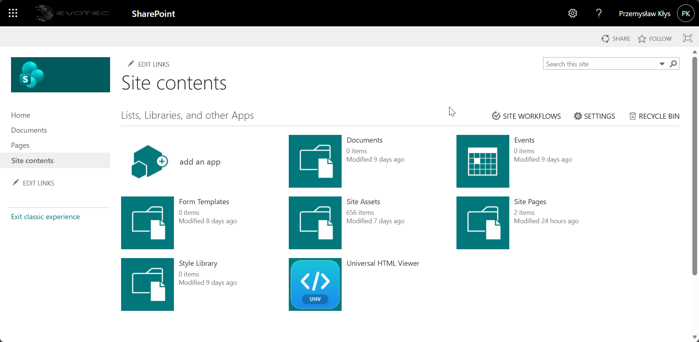
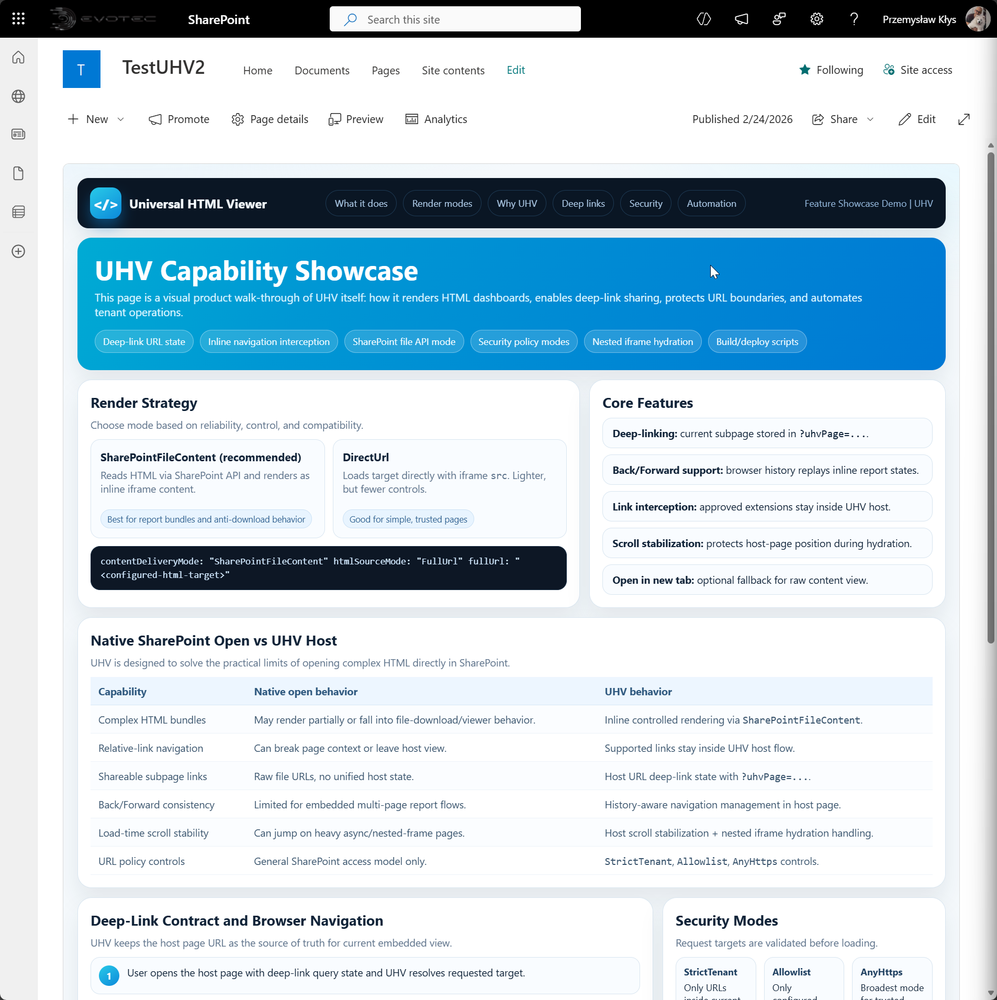
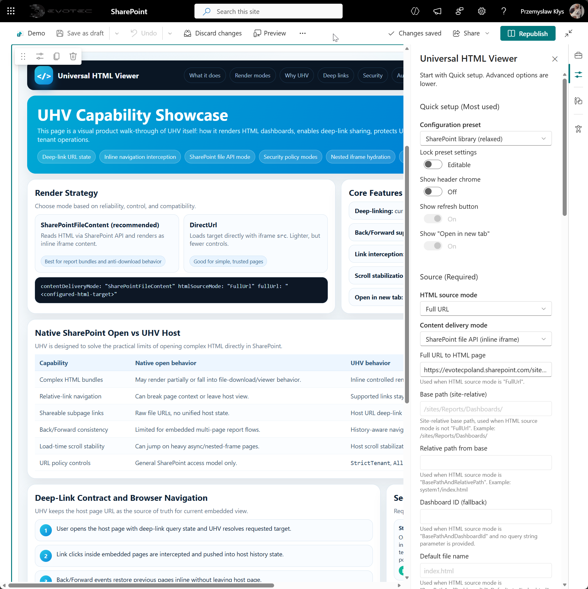
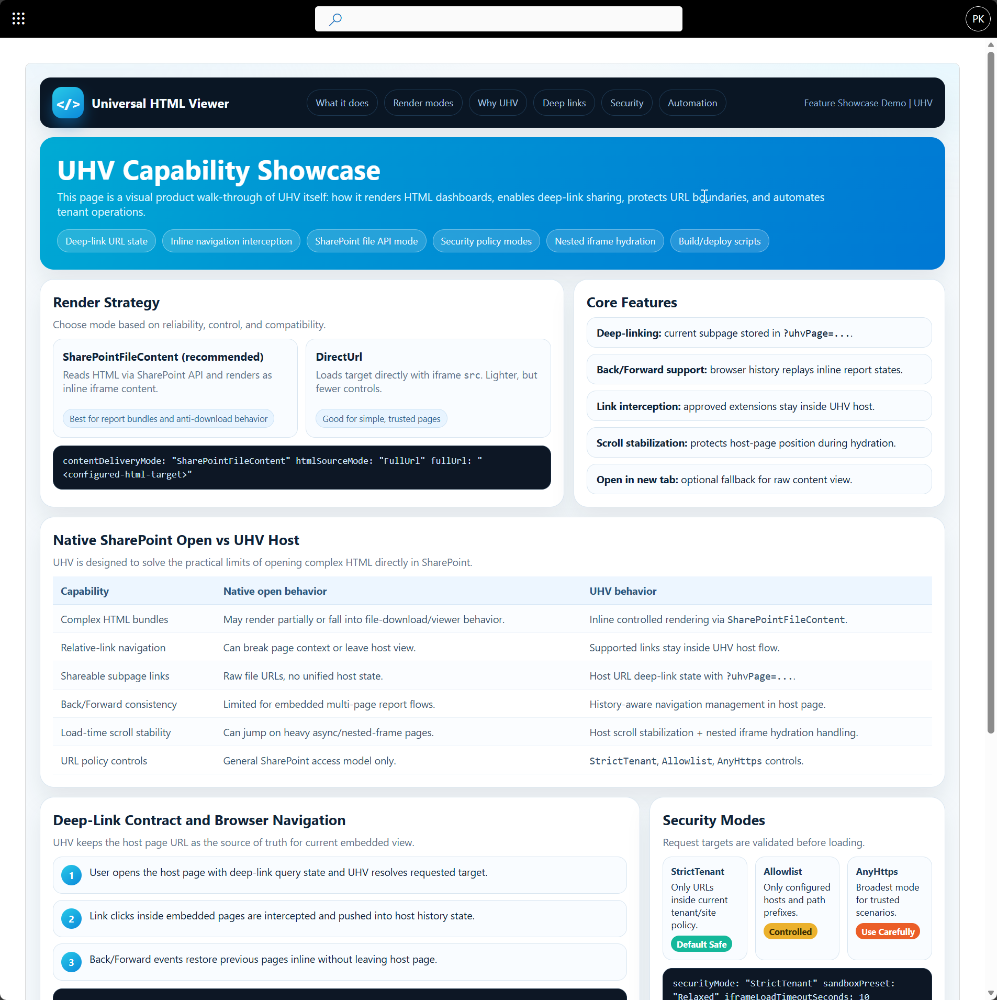
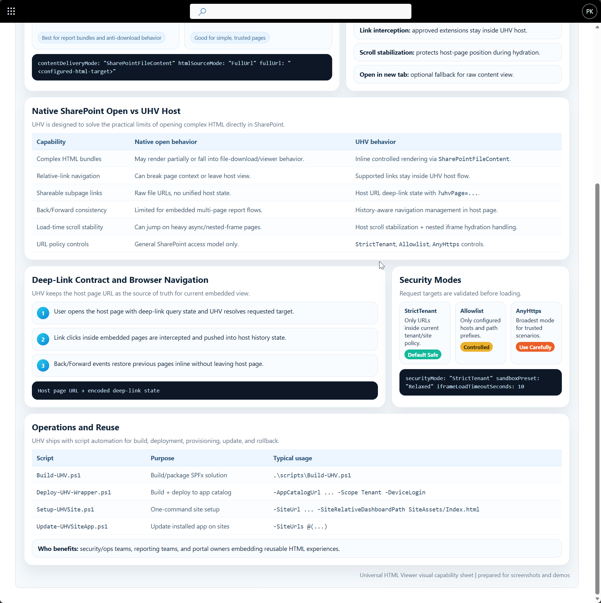
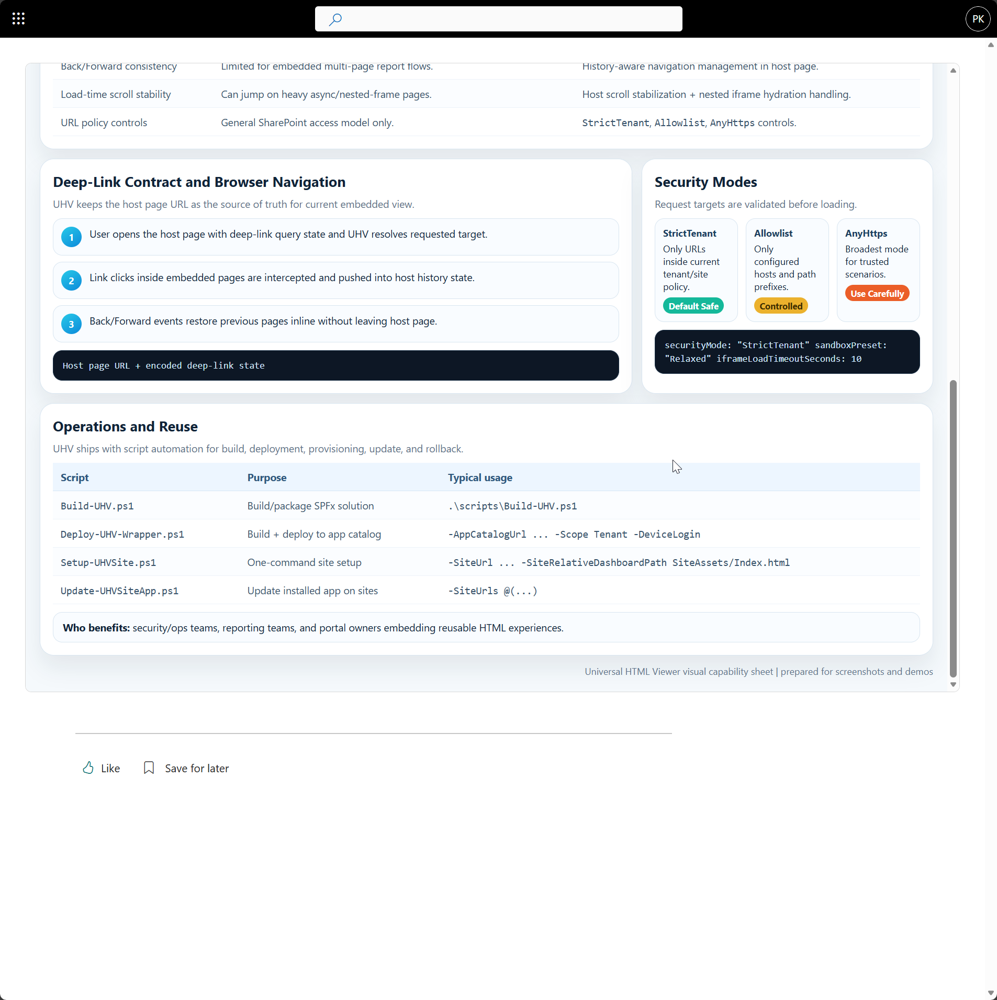
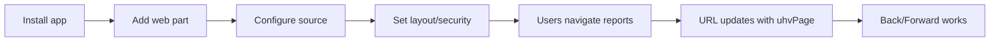
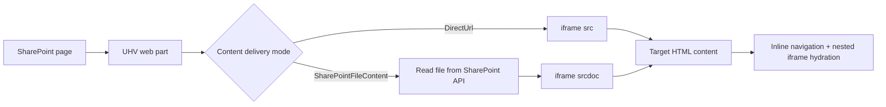
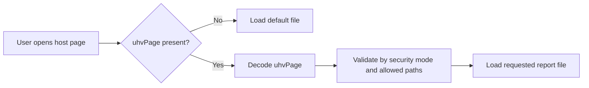
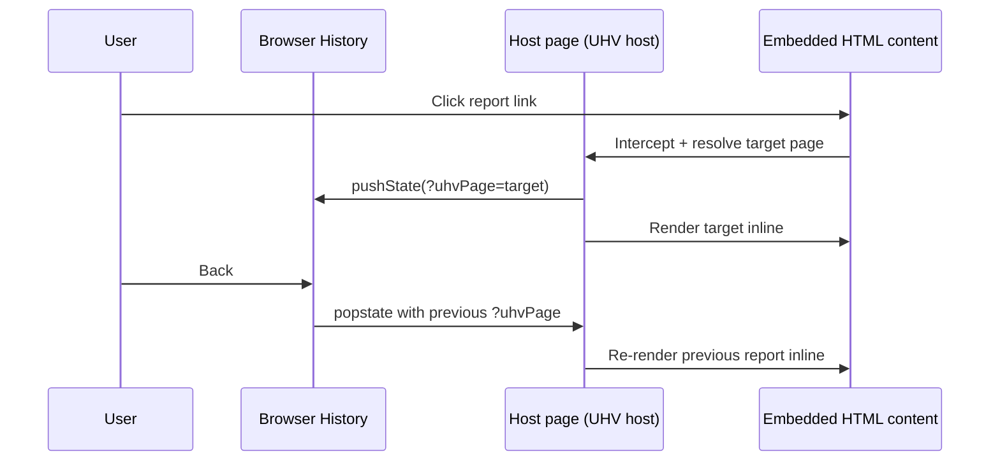

# UniversalHtmlViewer (UHV) 🚀

SPFx web part for hosting HTML experiences in modern SharePoint pages, with deep-link navigation, inline rendering, security controls, and deployment automation.

[](https://github.com/EvotecIT/UltimateHtmlViewer/actions/workflows/spfx-tests.yml)
[](https://github.com/EvotecIT/UltimateHtmlViewer/actions/workflows/release-sppkg.yml)
[](https://github.com/EvotecIT/UltimateHtmlViewer)

Security notes and current dependency-alert disposition: `SECURITY.md`

## 📦 Platform and Compatibility

- SPFx runtime target: `1.21.1` packages in `spfx/UniversalHtmlViewer/package.json`.
- Web part manifest version: `1.0.14` in `spfx/UniversalHtmlViewer/src/webparts/universalHtmlViewer/UniversalHtmlViewerWebPart.manifest.json`.
- Node for CI/build: `22.x` (see GitHub workflows and package engine constraint).

## 🔄 CI/CD Workflows

- `spfx-tests.yml`: cross-platform lint + unit tests + bundle validation on push/PR.
- `release-sppkg.yml`: ship bundle/package build, release artifact generation, and optional GitHub Release creation on `v*` tags or manual dispatch.
- Release packaging outputs are versioned as `release/universal-html-viewer-<manifest-version>.sppkg` in CI artifacts.

## ✨ What UHV Solves

Static HTML report/app bundles in SharePoint often cause iframe download behavior, broken relative links, weak deep-linking, and inconsistent page scrolling. UHV provides a predictable host layer for those experiences.

## 🧭 What UHV Really Is

UHV is an SPFx app that delivers a reusable web part.

- It can be added to any modern SharePoint page.
- The host page name is arbitrary (`Dashboard.aspx`, `Reports.aspx`, `Ops.aspx`, etc.).
- It can live alongside other web parts on the same page.
- It hosts HTML content; it is not limited to "dashboards" only.

## 🆚 Native SharePoint HTML Open vs UHV

| Capability | Native SharePoint file open | UHV web part host |
| --- | --- | --- |
| Complex HTML bundles (scripts + nested iframes) | Can render inconsistently, partially, or trigger file-download behavior depending on headers/viewer context. | `SharePointFileContent` mode renders inline in a controlled host with consistent behavior. |
| Relative-link navigation between HTML pages | Often leaves current page context or behaves like raw file navigation. | Intercepts supported links and keeps navigation inside UHV host experience. |
| Shareable links to specific subpages | Usually tied to raw file URLs, not unified host-page state. | Uses host-page URL state (`?uhvPage=...`) for stable, shareable deep links. |
| Back/Forward browser behavior | Not guaranteed for embedded report-state transitions. | Managed through host URL state and history handling. |
| Initial load scroll stability on heavy pages | Can jump due to asynchronous layout and nested frame timing. | Adds host-scroll stabilization and nested iframe hydration protections. |
| URL boundary controls | General SharePoint permissions only. | Adds web-part-level URL policy (`StrictTenant`, `Allowlist`, `AnyHttps`). |

## 👥 Who UHV Helps

- Teams publishing generated report bundles (PowerShell, BI exports, static report generators).
- Operations/security teams that need stable deep-link sharing for investigations.
- Knowledge portals combining HTML apps with other SharePoint web parts on the same page.
- Any tenant needing governance-friendly hosting of custom HTML experiences without custom SPFx coding for each app.

## 🤝 Contributing: Start Here

If you are new to this repository, use this quick map:

- Product overview and configuration: `README.md`
- Deployment guide: `docs/Deploy-SharePointOnline.md`
- Reusable operations runbook: `docs/Operations-Runbook.md`
- Release checklist: `docs/Release-Checklist.md`

Most common contributor flows:

```powershell
# Build/package
.\scripts\Build-UHV.ps1

# Deploy package to app catalog
.\scripts\Deploy-UHV-Wrapper.ps1 -AppCatalogUrl "https://<tenant>.sharepoint.com/sites/appcatalog" -Scope Tenant -DeviceLogin

# One-command site setup
.\scripts\Setup-UHVSite.ps1 -SiteUrl "https://<tenant>.sharepoint.com/sites/Reports" -DeviceLogin
```

Use `ignore/` for local-only files (tenant values, private notes, temporary snippets).  
Template: `scripts/examples/UHV.LocalProfile.example.ps1` -> local copy: `ignore/UHV.LocalProfile.ps1`.

Contributor skills (repo-local playbooks): `skills/README.md`

## 🧩 Key Capabilities

- Render mode selection: `DirectUrl` or `SharePointFileContent` (inline `srcdoc`).
- Deep-link support with shareable page URLs via `?uhvPage=...`.
- Nested iframe hydration for report wrappers.
- Extension-aware inline navigation (`.html`, `.htm`, `.aspx` by default).
- Strong URL policy controls: `StrictTenant`, `Allowlist`, `AnyHttps`.
- Property-pane presets for fast setup (`SharePointLibraryRelaxed`, `FullPage`, `Strict`).
- Auto-height and width-fit behavior for large HTML pages.
- Scripted build/deploy/update/rollback workflows.

## 🖼️ Visual Story: From Install to Deep Links

This is the real journey users and admins follow in SharePoint.

For curated screenshot-friendly demo content, see:

- `samples/siteassets/UHV-Screenshot-Demo.html`
- `samples/siteassets/UHV-Feature-Showcase.html`
- `samples/siteassets/README.md`

### 1. App is visible in Site Contents

You can quickly confirm install status before touching any page configuration.



### 2. Add UHV web part to any modern page

Once added, UHV becomes the host layer for your HTML app/report experience.



### 3. Configure source and delivery mode

Set report source and use `SharePointFileContent` for inline rendering reliability.



### 4. Validate minimal runtime presentation

Use published view (optionally `?env=Embedded`) for a clean app-like experience.



### 5. Confirm deep links, security, and operations model

The showcase can document deep-link contract, policy modes, and deployment runbooks in one surface.



### 6. Final published experience

Published page view is ready for end users. Optional page social actions can be disabled at site scope.





### Screenshot Legend: Exact Option Mapping

Use this as a quick checklist when reproducing the setup from screenshots.

| Screenshot | Where | Option | Recommended value |
| --- | --- | --- | --- |
| `uhv-showcase-editor-quick-setup.png` | Quick setup | `Configuration preset` | `SharePoint library (relaxed)` |
| `uhv-showcase-editor-quick-setup.png` | Source | `HTML source mode` | `Full URL` |
| `uhv-showcase-editor-quick-setup.png` | Source | `Content delivery mode` | `SharePoint file API (inline iframe)` |
| `uhv-showcase-editor-quick-setup.png` | Source | `Full URL to HTML page` | `https://<tenant>.sharepoint.com/sites/<site>/Shared%20Documents/<entry>.html` |
| `uhv-showcase-runtime-embedded.png` | Runtime shell | `?env=Embedded` | Optional (when supported by host context) |
| `uhv-showcase-deeplink-security-ops.png` | Runtime behavior | `URL state` | `?uhvPage=<encoded-target>` |
| `uhv-showcase-deeplink-security-ops.png` | Security | URL policy mode | `StrictTenant` or `Allowlist` |
| `uhv-showcase-runtime-socialbar.png` | Site UX | Social bar | Optional; can be disabled per site |

### Legacy Demo Screenshots

Previous dashboard-oriented visuals are preserved for reference:

- `assets/legacy/uhv-dashboard-overview.png`
- `assets/legacy/uhv-dashboard-menu.png`
- `assets/legacy/uhv-property-pane-quick-setup.png`
- `assets/legacy/uhv-property-pane-layout-display.png`
- `assets/legacy/uhv-property-pane-security-iframe.png`

## ⚙️ How It Works




## Configuration Model

### Source and Delivery

| Setting | Options | Purpose |
| --- | --- | --- |
| `htmlSourceMode` | `FullUrl`, `BasePathAndRelativePath`, `BasePathAndDashboardId` | Defines how target HTML URL is built. |
| `contentDeliveryMode` | `DirectUrl`, `SharePointFileContent` | Chooses direct iframe URL vs inline file content from SharePoint API. |
| `queryStringParamName` | string | Query key used for ID/path source mode. |
| `defaultFileName` | string | Default file when the requested id/path is missing. |

### Layout and UX

| Setting | Typical value | Purpose |
| --- | --- | --- |
| `heightMode` | `Auto` | Auto-fit to content height (recommended for reports). |
| `fixedHeightPx` | `800-1000` | Minimum visual baseline in auto mode. |
| `fitContentWidth` | `true` | Shrinks wide report content to frame width. |
| `showChrome` | `true` | Top header with status/actions. |
| `showOpenInNewTab` | `true` | Gives fallback path to open raw report page. |

### Security and iframe policy

| Setting | Options | Purpose |
| --- | --- | --- |
| `securityMode` | `StrictTenant`, `Allowlist`, `AnyHttps` | URL policy boundary. |
| `allowedHosts` | host list | Explicit host allowlist for `Allowlist` mode. |
| `allowedPathPrefixes` | path list | Optional path constraints for tighter scope. |
| `sandboxPreset` | preset or custom | Controls iframe sandbox behavior. |
| `iframeAllow` | permissions policy string | Optional iframe permissions (`fullscreen`, etc.). |

## Recommended Setup (SharePoint-hosted report bundles)

- Preset: `SharePointLibraryRelaxed`
- Source mode: `FullUrl`
- Content delivery: `SharePointFileContent`
- Height mode: `Auto`
- Fit content to width: `On`
- Keep reports and linked pages in same tenant/site boundary
- Avoid `AnyHttps` unless you explicitly accept cross-host embedding risk.

## 🔗 URL Contract (Deep-Linking)

UHV treats the host SharePoint page URL as the navigation state for the embedded HTML content.

### URL shapes

- Base page (default entry file):
  - `https://<tenant>.sharepoint.com/sites/<site>/SitePages/HostPage.aspx`
- Deep-linked subpage/file:
  - `https://<tenant>.sharepoint.com/sites/<site>/SitePages/HostPage.aspx?uhvPage=%2Fsites%2F<site>%2FSiteAssets%2FReportA.html`

### What `uhvPage` means

- `uhvPage` points to the target HTML file to render inside UHV.
- Value is URL-encoded.
- Works with site-relative paths (recommended) and allowed absolute URLs (based on security mode).
- If `uhvPage` is missing, UHV falls back to configured default file.
- In `AnyHttps` mode, UHV intentionally ignores `uhvPage` overrides and keeps configured default URL to reduce open-redirect style abuse.



## ⬅️➡️ Back/Forward Navigation

UHV updates the browser URL as users click inline report links, so browser history works naturally.

- Click inside embedded HTML link/menu:
  - UHV intercepts eligible link and keeps navigation inline.
  - Host URL is updated with `?uhvPage=...`.
- Press browser Back/Forward:
  - UHV reads current `uhvPage`.
  - Correct report file is reloaded inline.
  - No full navigation away from the host page.



## 🧠 Why This Works Reliably

- Single source of truth:
  - URL query parameter (`uhvPage`) represents current embedded subpage.
- Controlled inline navigation:
  - UHV only intercepts approved extensions/links and normalizes paths.
- Security-gated loading:
  - All requested targets pass URL policy checks (`StrictTenant`, `Allowlist`, `AnyHttps`).
- Host-scroll protection during hydration:
  - Initial deep-link render temporarily locks host scroll until layout stabilizes.
- Nested iframe handling:
  - UHV resets nested iframe scroll context during hydration to reduce jumpy first paint.

## 🧭 Deep Links and Scroll Behavior

- Deep links are represented by `?uhvPage=<encoded-site-relative-or-absolute-path>`.
- UHV enforces top positioning during initial deep-link render.
- Scroll lock now waits for host/iframe stability and nested iframe hydration before release.
- If debugging is needed, append `?uhvTraceScroll=1` and inspect `[UHV scroll trace]` console events.

## 🔐 Permissions and Access Behavior

- UHV does not bypass SharePoint permissions.
- Access is evaluated from the viewer perspective for:
  - the SharePoint page containing UHV
  - the underlying report files/folders being loaded
- If user can open the page but not the target file, content load fails according to SharePoint security response.
- Shareable deep links still work only for users who have permission to both page and target file.

## 🚦 API and Throttling Considerations

- `SharePointFileContent` mode loads HTML through SharePoint REST (`GetFileByServerRelativeUrl(...)/$value`).
- With frequent refresh intervals and high traffic, this can increase API pressure.
- Keep `refreshIntervalMinutes` conservative and prefer `FileLastModified` cache-busting over aggressive timestamp refreshes.

## ♿ Accessibility Notes

- UHV provides an iframe host shell, but accessibility of rendered report content depends on the HTML inside that iframe.
- Set a meaningful `iframeTitle`, use semantic HTML in report pages, and validate embedded content against your WCAG baseline.

## 🎛️ Minimal Viewer Mode (Tips & Tricks)

- Use a published page view (not edit mode) for a clean runtime surface.
- Add `?env=Embedded` to page URLs to reduce SharePoint chrome where supported.
- Turn off page comments in **Page details** when you do not need discussion threads.
- Disable Social Bar (`Like`, `Save for later`, views) at site scope:

```powershell
Import-Module Microsoft.Online.SharePoint.PowerShell
Connect-SPOService -Url "https://<tenant>-admin.sharepoint.com"
Set-SPOSite -Identity "https://<tenant>.sharepoint.com/sites/<site>" -SocialBarOnSitePagesDisabled $true
```

- Re-enable Social Bar later if needed:

```powershell
Set-SPOSite -Identity "https://<tenant>.sharepoint.com/sites/<site>" -SocialBarOnSitePagesDisabled $false
```

- If you are already using PnP admin auth and cannot use `Connect-SPOService`, site-scope CSOM fallback:

```powershell
Connect-PnPOnline -Url "https://<tenant>-admin.sharepoint.com" -DeviceLogin -ClientId "<client-guid>" -Tenant "<tenant>.onmicrosoft.com"
$ctx = Get-PnPContext
$tenant = [Microsoft.Online.SharePoint.TenantAdministration.Tenant]::new($ctx)
$siteProps = $tenant.GetSitePropertiesByUrl("https://<tenant>.sharepoint.com/sites/<site>", $true)
$ctx.Load($siteProps); $ctx.ExecuteQuery()
$siteProps.SocialBarOnSitePagesDisabled = $true
$siteProps.Update(); $ctx.ExecuteQuery()
```

- Editors/owners may still see authoring commands (`New`, `Promote`, `Edit`) because those are permission-driven.

## 🛠️ Build and Deploy

Full deployment guide: `docs/Deploy-SharePointOnline.md`
Operations runbook (reusable): `docs/Operations-Runbook.md`

### Quick commands

```powershell
# Optional: load your local (non-committed) profile values
. .\ignore\UHV.LocalProfile.ps1

# Build package
.\scripts\Build-UHV.ps1

# One-command site setup (recommended)
.\scripts\Setup-UHVSite.ps1 `
  -SiteUrl "https://<tenant>.sharepoint.com/sites/Reports" `
  -SiteRelativeDashboardPath "SiteAssets/Index.html" `
  -ConfigurationPreset "SharePointLibraryRelaxed" `
  -ContentDeliveryMode "SharePointFileContent" `
  -DeviceLogin

# Build + deploy to tenant app catalog
.\scripts\Deploy-UHV-Wrapper.ps1 `
  -AppCatalogUrl "https://<tenant>.sharepoint.com/sites/appcatalog" `
  -Scope Tenant `
  -DeviceLogin `
  -ClientId "<client-guid>" `
  -Tenant "<tenant>.onmicrosoft.com" `
  -TenantAdminUrl "https://<tenant>-admin.sharepoint.com"

# Update installed app on sites
.\scripts\Update-UHVSiteApp.ps1 `
  -SiteUrls @(
    "https://<tenant>.sharepoint.com/sites/SiteA",
    "https://<tenant>.sharepoint.com/sites/SiteB"
  ) `
  -InstallIfMissing `
  -DeviceLogin `
  -ClientId "<client-guid>" `
  -Tenant "<tenant>.onmicrosoft.com"

# All-in-one deploy/update pipeline (tenant + target sites)
.\scripts\Deploy-UHV-All.ps1 `
  -ClientId "<client-guid>" `
  -Tenant "<tenant>.onmicrosoft.com" `
  -DeviceLogin
```

Note: `-SiteRelativeDashboardPath` is a backward-compatible name and accepts any HTML entry file path.

## 📜 Scripts Reference

| Script | Purpose |
| --- | --- |
| `scripts/Build-UHV.ps1` | Build/package with local Node bootstrap fallback. |
| `scripts/Deploy-UHV.ps1` | Upload/publish `.sppkg` to app catalog. |
| `scripts/Deploy-UHV-Wrapper.ps1` | Build + deploy wrapper. |
| `scripts/Deploy-UHV-All.ps1` | Build, deploy to app catalog, then update/install on target sites. |
| `scripts/Setup-UHVSite.ps1` | Install/update app and provision configured page. |
| `scripts/Add-UHVPage.ps1` | Add/configure UHV web part on a site page. |
| `scripts/Update-UHVSiteApp.ps1` | Update installed app on one or more sites. |
| `scripts/Rollback-UHV.ps1` | Roll back to older package and reapply site updates. |
| `scripts/examples/UHV.LocalProfile.example.ps1` | Template for local auth/tenant profile values. |

## 🧰 Local-Only Operator Files

Use `ignore/` for local notes, secrets, and machine-specific snippets.

- Folder is intentionally ignored by git.
- Keep reusable templates in `scripts/examples/`.
- Copy template to `ignore/` and edit locally:

```powershell
Copy-Item .\scripts\examples\UHV.LocalProfile.example.ps1 .\ignore\UHV.LocalProfile.ps1
```

Scripts support auth fallbacks from environment variables:

- `UHV_CLIENT_ID`
- `UHV_TENANT`

## 🩺 Troubleshooting

- Report downloads instead of rendering: switch to `SharePointFileContent`.
- Navigation not staying inline: verify relative links and allowed extensions.
- Deep-link opens but landing position is wrong: retest with `?uhvTraceScroll=1` and review trace.
- Page editing issues (`SavePageCoAuth 400`): often SharePoint authoring state; see deployment guide.

## 📁 Repo Layout

```text
.
├─ assets/
├─ samples/
│  └─ siteassets/
├─ docs/
│  ├─ Deploy-SharePointOnline.md
│  └─ Operations-Runbook.md
├─ ignore/                  (local-only, non-committed workspace)
├─ scripts/
│  └─ examples/
└─ spfx/
   └─ UniversalHtmlViewer/
```
