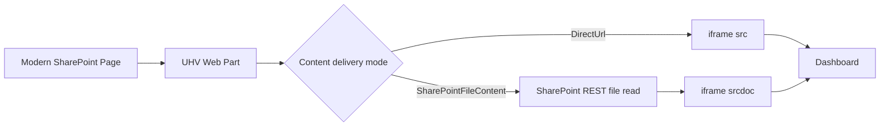

# UniversalHtmlViewer - SharePoint SPFx HTML Dashboard Host

UniversalHtmlViewer (UHV) is an SPFx web part for rendering HTML dashboards inside modern SharePoint pages, with security and deployment controls suitable for enterprise tenants.

📦 Project Status

[](https://github.com/EvotecIT/UltimateHtmlViewer/actions/workflows/spfx-tests.yml)
[](https://github.com/EvotecIT/UltimateHtmlViewer/actions/workflows/release-sppkg.yml)
[](https://github.com/EvotecIT/UltimateHtmlViewer)
[](https://github.com/EvotecIT/UltimateHtmlViewer)

## Documentation map

- Overview and product behavior: `README.md`
- SharePoint deployment and operations: `docs/Deploy-SharePointOnline.md`

🛠️ Tech Stack

- SharePoint Framework (SPFx)
- TypeScript + React
- PnP.PowerShell deployment automation

👨‍💻 Author & Social

[](https://twitter.com/PrzemyslawKlys)
[](https://evotec.xyz/hub)
[](https://www.linkedin.com/in/pklys)
[](https://evo.yt/discord)

## What it's all about

UHV solves a common SharePoint Online problem: static report HTML in libraries is often awkward to host reliably inside modern pages.  
The web part gives you two rendering models:

- `DirectUrl`: normal iframe to URL.
- `SharePointFileContent`: reads file content from SharePoint API and renders inline (`srcdoc`) to improve compatibility for SharePoint-hosted report bundles.

This is especially useful for generated dashboard trees (`index.html` + linked pages/assets), including nested iframe patterns and `.aspx` navigation in inline mode.

## Why teams use UHV

- Keep dashboard hosting inside SharePoint (no separate web server required).
- Avoid legacy custom-script-centric hosting patterns.
- Standardize security policy (tenant-only, allowlist, or broader HTTPS mode).
- Give site owners a repeatable deployment flow (build, publish, install, onboard, update, rollback).

## How it works



## Feature highlights

- Multiple source modes: full URL, base+relative, base+dashboardId.
- Content delivery modes: direct iframe and SharePoint file API inline.
- Extension-aware inline navigation (`.html`, `.htm`, `.aspx` by default).
- Nested iframe hydration for SharePoint-hosted report wrappers.
- Security modes: `StrictTenant`, `Allowlist`, `AnyHttps`.
- Presets for practical scenarios (`SharePointLibraryRelaxed`, `FullPage`, `Strict`).
- Auto-height and fit-to-width options for dashboard layout.
- Tenant config JSON (`Merge` or `Override`).
- Export/import configuration from property pane.
- Deployment automation scripts (deploy, onboard, update, rollback).

## Quick start

### 1) Build package

```powershell
.\scripts\Build-UHV.ps1
```

Output:

```text
spfx/UniversalHtmlViewer/sharepoint/solution/universal-html-viewer.sppkg
```

### 2) Deploy to app catalog

```powershell
.\scripts\Deploy-UHV-Wrapper.ps1 `
  -AppCatalogUrl "https://<tenant>.sharepoint.com/sites/appcatalog" `
  -Scope Tenant `
  -DeviceLogin `
  -ClientId "<client-guid>" `
  -Tenant "<tenant>.onmicrosoft.com" `
  -TenantAdminUrl "https://<tenant>-admin.sharepoint.com"
```

### 3) Onboard a site in one command

```powershell
.\scripts\Setup-UHVSite.ps1 `
  -SiteUrl "https://<tenant>.sharepoint.com/sites/Reports" `
  -SiteRelativeDashboardPath "SiteAssets/Index.html" `
  -PageName "Dashboard" `
  -PageTitle "Dashboard" `
  -ConfigurationPreset "SharePointLibraryRelaxed" `
  -ContentDeliveryMode "SharePointFileContent" `
  -ClientId "<client-guid>" `
  -Tenant "<tenant>.onmicrosoft.com" `
  -DeviceLogin
```

## Recommended dashboard settings (SharePoint-hosted files)

For dashboard/report bundles stored in SharePoint libraries:

- `Configuration preset`: `SharePointLibraryRelaxed`
- `HTML source mode`: `Full URL`
- `Content delivery mode`: `SharePoint file API (inline iframe)`
- `Height mode`: `Auto (content height)`
- `Fit content to width (inline mode)`: `On`
- `Minimum height`: usually `800-1000`

Tips:

- Upload the full folder tree, not just `index.html`.
- Keep links relative (`./`, `../`) when possible.
- Keep file set in same tenant/path boundary.

## Deployment models

### Site-scoped (recommended for controlled rollouts)

- Publish package to app catalog.
- Install app per site where needed.
- Least blast radius; ideal for client-by-client rollout.

### Tenant app catalog publish

- Package is available centrally.
- With current config, `skipFeatureDeployment=false` in `spfx/UniversalHtmlViewer/config/package-solution.json`, so site installation is typically still required.

## Scripts reference

| Script | Purpose |
| --- | --- |
| `scripts/Build-UHV.ps1` | Build/package with known-good local Node bootstrap fallback. |
| `scripts/Deploy-UHV.ps1` | Publish `.sppkg` to app catalog (site/tenant scope). |
| `scripts/Deploy-UHV-Wrapper.ps1` | Build + deploy wrapper. |
| `scripts/deploy-uhv.cmd` | Windows shortcut for wrapper. |
| `scripts/Add-UHVPage.ps1` | Create page, add UHV web part, set properties. |
| `scripts/Setup-UHVSite.ps1` | Install/update app on site and create configured dashboard page. |
| `scripts/Update-UHVSiteApp.ps1` | Upgrade installed app instance across many sites. |
| `scripts/Rollback-UHV.ps1` | Republish older package and update target sites. |
| `scripts/Package-UHV.ps1` | Create client-ready release zip. |

## Local development

Prerequisites:

- Node.js `>=22.14.0 <23.0.0`
- npm

Install:

```bash
cd spfx/UniversalHtmlViewer
npm ci
```

Run SPFx serve:

```bash
npm run serve
```

Workbench:

```text
https://<tenant>.sharepoint.com/_layouts/workbench.aspx
```

## Testing

```bash
cd spfx/UniversalHtmlViewer
npm test
```

Current unit tests cover URL/source computation and inline navigation helpers.

## Security and trust model

SharePoint Online does not use Authenticode-style signing for `.sppkg`.  
Trust is governed by:

- App catalog upload/publish permissions,
- Tenant/site admin approval and installation flow,
- SharePoint tenant security controls.

Recommended operational controls:

- Use versioned release artifacts from CI.
- Verify checksums (`SHA256SUMS.txt`) for release bundles.
- Keep deployment rights least-privileged.
- Optionally sign internal PowerShell scripts in your org process.

## Troubleshooting quick hits

- Dashboard opens as download / iframe timeout:
  use `SharePointFileContent` mode.
- Linked pages do not navigate inline:
  keep links relative and use a SharePoint library preset.
- Nested iframe wrappers fail:
  use relaxed SharePoint preset with inline mode.
- Page edit exits with `SavePageCoAuth 400`:
  often SharePoint authoring issue; temporary workaround:
  `Set-PnPList -Identity "Site Pages" -ForceCheckout:$true`.
- Fluid schema error on script-created page:
  recreate with latest `Add-UHVPage.ps1 -ForceOverwrite`.

## Documentation

- Deployment guide: `docs/Deploy-SharePointOnline.md`
- SPFx solution root: `spfx/UniversalHtmlViewer`

## Repository structure

```text
.
├─ docs/
│  └─ Deploy-SharePointOnline.md
├─ scripts/
│  ├─ Build-UHV.ps1
│  ├─ Deploy-UHV.ps1
│  ├─ Deploy-UHV-Wrapper.ps1
│  ├─ Add-UHVPage.ps1
│  ├─ Setup-UHVSite.ps1
│  ├─ Update-UHVSiteApp.ps1
│  └─ Rollback-UHV.ps1
└─ spfx/
   └─ UniversalHtmlViewer/
```

## Please share with the community

[](https://reddit.com/submit?url=https://github.com/EvotecIT/UltimateHtmlViewer&title=UniversalHtmlViewer)
[](https://news.ycombinator.com/submitlink?u=https://github.com/EvotecIT/UltimateHtmlViewer)
[](https://twitter.com/share?url=https://github.com/EvotecIT/UltimateHtmlViewer&t=UniversalHtmlViewer)
[](https://www.linkedin.com/shareArticle?url=https://github.com/EvotecIT/UltimateHtmlViewer&title=UniversalHtmlViewer)
